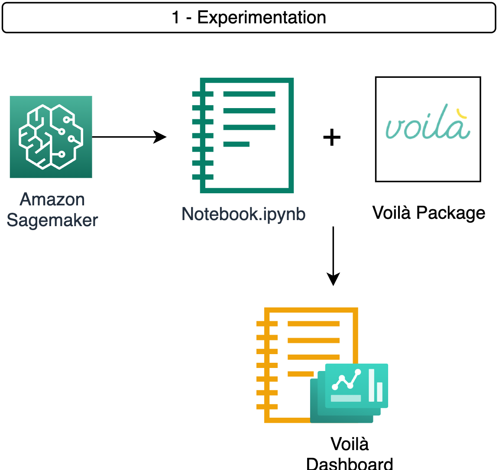
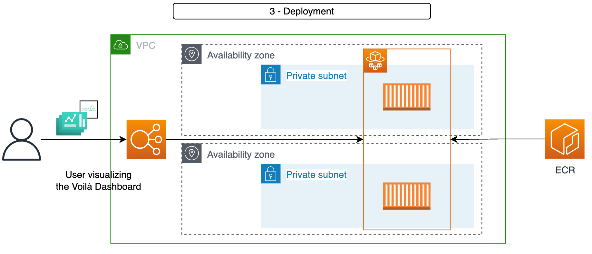
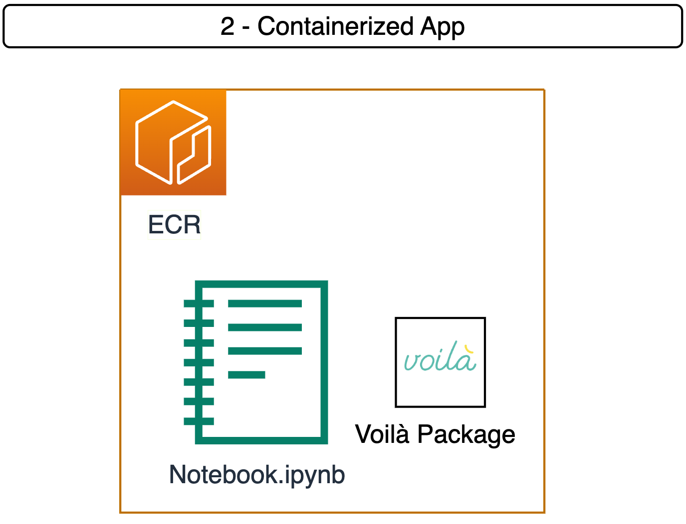

# Share your Sagemaker notebook as a standalone web application with Voilà

## Overview
This solution provides a simple way to share your voilà App internaly. It uses an Amazon Fargate to display the dashboard/application generated by [voilà](https://voila.readthedocs.io/en/stable/using.html).

## Architecture

## Prerequisites

- AWS Account and AWS credentials configured locally
- [aws-cdk-lib](https://pypi.org/project/aws-cdk-lib/) 2.1 or higher
- [Docker](https://docs.docker.com/engine/install/) installed locally

## Deploy using AWS CDK

Follow the below steps to deploy this solution;

Clone the repository and navigate to the project directory.
```shell
git clone <repo-url>
cd voila-apg
```
Create a virtualenv on MacOS and Linux:

```shell
$ python3 -m venv .env
```

After the init process completes and the virtualenv is created, you can use the following
step to activate your virtualenv.

```shell
$ source .env/bin/activate
```

If you are a Windows platform, you would activate the virtualenv like this:

```shell
% .env\Scripts\activate.bat
```

Once the virtualenv is activated, you can install the required dependencies.

```shell
$ pip install -r requirements.txt
```

* CDK Bootstrap - Bootstrap your AWS account for CDK. This only needs to be done once per account/region.
```shell
cdk bootstrap aws://<account>/<region>
```

### Installation

### Setup
If you want to deploy the solution on an already existing VPC, please in [cdk.json](cdk.json) specify the "vpc_id":

```python
  "context": {
    "aws-cdk:enableDiffNoFail": "true",
    "vpc_id":vpc_id
  }
```
Otherwise, the "vpc_id" is setup to null and the solution will create a VPC to host the application.
```python
  "context": {
    "aws-cdk:enableDiffNoFail": "true",
    "vpc_id":null
  }
```
### Deployment of the App







Deploy the stack.
```shell
cdk deploy 
```

Successfully deployed stack will output the URL from where you can access the app you deployed:
```shell
Outputs:
Voila-app-from-Notebook.WebAppFargateServiceLoadBalancer = ***
Voila-app-from-Notebook.WebAppFargateServiceServiceURL = http://***
```

Alternatively, you can also retrieve your app's URL in the AWS Management Console: Under EC2/Load balancers, select your application's Load Balancer and copy its DNS name.

### Delete the App 
Destroy the stack.
```shell
cdk destroy 
```

## Useful commands

 * `cdk ls`          list all stacks in the app
 * `cdk synth`       emits the synthesized CloudFormation template
 * `cdk deploy`      deploy this stack to your default AWS account/region
 * `cdk diff`        compare deployed stack with current state
 * `cdk docs`        open CDK documentation

Enjoy!
